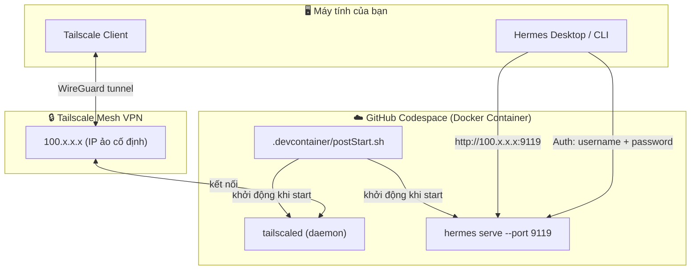
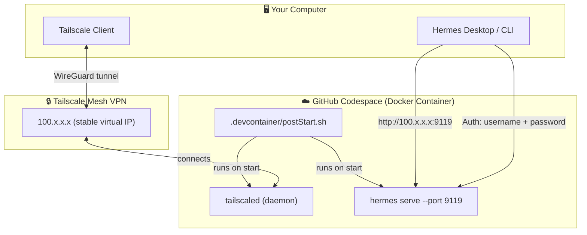

# 🚀 Codespaces Hermes Server

> **Run Hermes Agent as a personal AI backend on free GitHub Codespaces — 24/7, zero cost, zero maintenance.**

[]()
[]()
[]()
[]()
[]()

---

<p align="center">
  <a href="#-tiếng-việt"></a>
  &nbsp;&nbsp;&nbsp;
  <a href="#-english"></a>
</p>

---

<!-- ========================================================================= -->
<!-- 🇻🇳 TIẾNG VIỆT -->
<!-- ========================================================================= -->

## 🇻🇳 Tiếng Việt

### 📖 Giới thiệu

Dự án này cung cấp **hướng dẫn chi tiết từ A đến Z** để thiết lập **Hermes Agent** chạy trên **GitHub Codespaces** miễn phí, biến nó thành server cá nhân mà bạn có thể truy cập từ mọi nơi.

**Bạn sẽ học cách:**
- ✅ Tạo tài khoản GitHub và repository miễn phí
- ✅ Cấu hình `.devcontainer` để tự động cài Hermes Agent
- ✅ Kết nối Codespace với máy local qua **Tailscale VPN**
- ✅ Chạy Hermes ở chế độ server — truy cập remote từ Hermes Desktop
- ✅ Quản lý core-hours và tối ưu chi phí

> 💡 **Mới bắt đầu?** Không sao! Hướng dẫn này dành cho cả người chưa từng dùng GitHub.

---

### 🗺️ Kiến trúc tổng quan



> **Cách hoạt động:** Codespace chạy `hermes serve` → Tailscale gán IP cố định → Máy local kết nối qua Tailscale vào IP đó → Hermes Desktop remote về Codespace.

---

### 📚 Hướng dẫn chi tiết (Tiếng Việt)

| # | Phần | Mô tả | ⏱️ |
|---|------|-------|-----|
| 1 | [Tạo tài khoản GitHub](docs/vi/01-create-github-account.md) | Đăng ký GitHub Free, xác thực email | 5 phút |
| 2 | [Tạo Repository](docs/vi/02-create-repository.md) | Tạo repo private mới | 3 phút |
| 3 | [Cấu hình .devcontainer](docs/vi/03-setup-devcontainer.md) | Tạo config chuẩn cho Codespace | 5 phút |
| 4 | [Cấu hình Idle Timeout](docs/vi/04-configure-idle-timeout.md) | Tăng thời gian chờ trước khi tắt | 2 phút |
| 5 | [Tạo Codespace](docs/vi/05-create-codespace.md) | Khởi tạo và làm quen với Codespace | 3 phút |
| 6 | [Cài Hermes & Kết nối Remote](docs/vi/06-install-hermes-connect-remote.md) | Setup Hermes server + Tailscale + remote connect | 15 phút |
| 7 | ⭐ [Quản lý Codespace qua CLI](docs/vi/07-codespace-cli-management.md) | Cài gh CLI, tạo shortcut start/stop, tự động hoá | 10 phút |


---

### 📦 Nội dung repository

```
codespaces-hermes-server/
├── .devcontainer/
│   ├── devcontainer.json       # Config: gọi postCreate.sh + postStart.sh
│   ├── postCreate.sh           # Cài Hermes Agent (1 lần)
│   └── postStart.sh            # Khởi động Tailscale + Hermes serve (mỗi lần start)
├── docs/
│   ├── vi/                     # Hướng dẫn tiếng Việt (7 phần)
│   └── en/                     # English guide (7 parts)
├── .gitignore
├── LICENSE                     # MIT License
├── SECURITY.md                 # Chính sách bảo mật
└── README.md                   # Bạn đang ở đây
```

---

### ⚡ Quickstart (Tóm tắt nhanh)

```bash
# 1. Tạo GitHub account + private repo
# 2. Thêm 3 file vào .devcontainer/ (có sẵn trong repo này)
# 3. Set idle timeout → 240 phút trong Settings → Codespaces
# 4. Tạo Codespace → đợi postCreate.sh cài Hermes
# 5. Trong Codespace:
curl -fsSL https://tailscale.com/install.sh | sh
sudo tailscaled --tun=userspace-networking &
sudo tailscale up          # Đăng nhập Tailscale
tailscale ip               # Ghi lại IP 100.x.x.x

# 6. Tạo file auth
cat >> ~/.hermes/.env <<'EOF'
HERMES_DASHBOARD_BASIC_AUTH_USERNAME=admin
HERMES_DASHBOARD_BASIC_AUTH_PASSWORD=<your-strong-password>
HERMES_DASHBOARD_BASIC_AUTH_SECRET=<openssl rand -base64 32>
EOF
chmod 600 ~/.hermes/.env

# 7. Restart Codespace → Hermes tự động online
# 8. Trên máy local: Hermes Settings → Gateway → http://100.x.x.x:9119
```

---

### 📊 So sánh: GitHub Free vs Pro

| Tính năng | GitHub Free | GitHub Pro |
|-----------|-------------|------------|
| Repo private | ✅ Không giới hạn | ✅ Không giới hạn |
| Cộng tác viên trên private repo | ✅ Tối đa 3 người | ✅ Không giới hạn |
| Codespaces core-hours/tháng | **120 core-hours** | 180 core-hours |
| GitHub Actions phút/tháng | 2,000 phút | 3,000 phút |

> Với mục đích chạy Hermes Agent cá nhân, **GitHub Free là hoàn toàn đủ**.

> ⚙️ **Về machine type:** Khi tạo Codespace, mặc định là **2 core — 8GB RAM**. Nếu muốn đổi, sau khi tạo Codespace xong, vào **https://github.com/codespaces** → click **`...`** (More actions) bên cạnh Codespace → **Change machine type**. Chỉ có 2 tuỳ chọn trên Free: 2-core (8GB) hoặc 4-core (8GB).

---

<!-- ========================================================================= -->
<!-- 🇬🇧 ENGLISH -->
<!-- ========================================================================= -->

## 🇬🇧 English

### 📖 Overview

This project provides a **complete step-by-step guide** for running **Hermes Agent** on **free GitHub Codespaces** as your personal AI backend — accessible from anywhere.

**What you'll learn:**
- ✅ Create a free GitHub account and private repository
- ✅ Configure `.devcontainer` for automatic Hermes Agent installation
- ✅ Connect your Codespace to your local machine via **Tailscale VPN**
- ✅ Run Hermes in server mode and connect remotely from Hermes Desktop
- ✅ Manage core-hours and optimize costs

> 💡 **New to this?** No problem! This guide is designed for absolute beginners.

---

### 🗺️ Architecture Overview



> **How it works:** Codespace runs `hermes serve` → Tailscale assigns a stable IP → Your local machine connects via Tailscale → Hermes Desktop remotes to the Codespace.

---

### 📚 Detailed Guide (English)

| # | Part | Description | ⏱️ |
|---|------|-------------|-----|
| 1 | [Create a GitHub Account](docs/en/01-create-github-account.md) | Sign up for GitHub Free, verify email | 5 min |
| 2 | [Create a Repository](docs/en/02-create-repository.md) | Create a new private repo | 3 min |
| 3 | [Set up .devcontainer](docs/en/03-setup-devcontainer.md) | Create the Codespace configuration | 5 min |
| 4 | [Configure Idle Timeout](docs/en/04-configure-idle-timeout.md) | Increase timeout before shutdown | 2 min |
| 5 | [Create a Codespace](docs/en/05-create-codespace.md) | Launch and explore your Codespace | 3 min |
| 6 | [Install Hermes & Connect Remote](docs/en/06-install-hermes-connect-remote.md) | Full setup: Hermes server + Tailscale + remote | 15 min |
| 7 | ⭐ [Codespace CLI Management](docs/en/07-codespace-cli-management.md) | Install gh CLI, create start/stop shortcuts, automate | 10 min |

---

### 📦 Repository Contents

```
codespaces-hermes-server/
├── .devcontainer/
│   ├── devcontainer.json       # Config: calls postCreate.sh + postStart.sh
│   ├── postCreate.sh           # Installs Hermes Agent (one-time)
│   └── postStart.sh            # Starts Tailscale + Hermes serve (every restart)
├── docs/
│   ├── vi/                     # Vietnamese guide (6 parts)
│   └── en/                     # English guide (6 parts)
├── .gitignore
├── LICENSE                     # MIT License
├── SECURITY.md                 # Security policy
└── README.md                   # You are here
```

---

### ⚡ Quickstart

```bash
# 1. Create GitHub account + private repo
# 2. Add 3 files to .devcontainer/ (included in this repo)
# 3. Set idle timeout → 240 min in Settings → Codespaces
# 4. Create Codespace → wait for postCreate.sh to install Hermes
# 5. Inside Codespace:
curl -fsSL https://tailscale.com/install.sh | sh
sudo tailscaled --tun=userspace-networking &
sudo tailscale up          # Log in to Tailscale
tailscale ip               # Save the 100.x.x.x IP

# 6. Create auth file
cat >> ~/.hermes/.env <<'EOF'
HERMES_DASHBOARD_BASIC_AUTH_USERNAME=admin
HERMES_DASHBOARD_BASIC_AUTH_PASSWORD=<your-strong-password>
HERMES_DASHBOARD_BASIC_AUTH_SECRET=<openssl rand -base64 32>
EOF
chmod 600 ~/.hermes/.env

# 7. Restart Codespace → Hermes auto-starts
# 8. On local machine: Hermes Settings → Gateway → http://100.x.x.x:9119
```

---

### 📊 GitHub Free vs Pro Comparison

| Feature | GitHub Free | GitHub Pro |
|---------|-------------|------------|
| Private repos | ✅ Unlimited | ✅ Unlimited |
| Collaborators on private repos | ✅ Up to 3 | ✅ Unlimited |
| Codespaces core-hours/month | **120 core-hours** | 180 core-hours |
| GitHub Actions minutes/month | 2,000 min | 3,000 min |

> For running a personal Hermes Agent backend, **GitHub Free is more than enough**.

> ⚙️ **About machine type:** When you create a Codespace, the default is **2 core — 8GB RAM**. To change it after creation, go to **https://github.com/codespaces** → click **`...`** (More actions) next to your Codespace → **Change machine type**. Free tier only offers 2 options: 2-core (8GB) or 4-core (8GB).

---

## 🤝 Contributing

Contributions are welcome! Please read [CONTRIBUTING.md](CONTRIBUTING.md) before submitting a pull request.

## 🔒 Security

Found a vulnerability? See our [Security Policy](SECURITY.md) for reporting guidelines.

## 📄 License

This project is licensed under the MIT License — see the [LICENSE](LICENSE) file for details.

---

<p align="center">
  <strong>⭐ Star this repo if you find it useful!</strong><br>
  📧 <a href="mailto:skappafrost@gmail.com">skappafrost@gmail.com</a>
</p>
