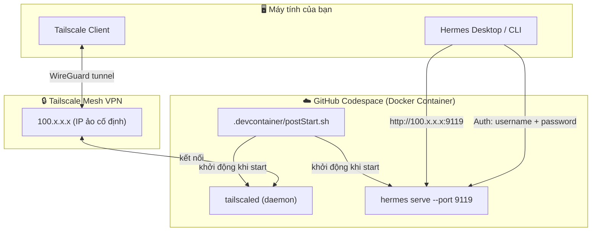
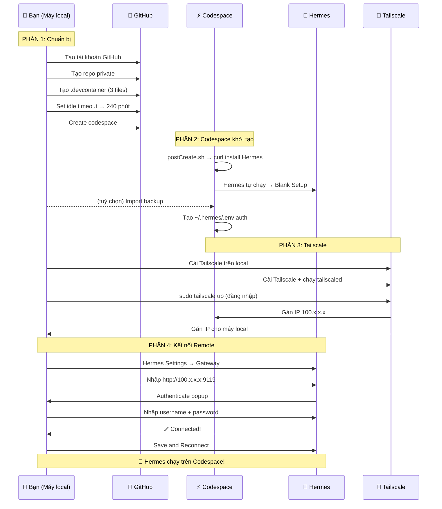

# 🚀 Codespaces Hermes Server

[]()
[]()
[]()
[]()

> **🇻🇳 Hướng dẫn thiết lập GitHub Codespaces miễn phí để chạy Hermes Agent như server cá nhân**
> **🇬🇧 Complete guide to running Hermes Agent on free GitHub Codespaces as your personal AI backend**

<p align="center">
  ⭐ Star repo này nếu bạn thấy hữu ích! &nbsp;|&nbsp; 📧 skappafrost@gmail.com
</p>

---

## 📊 Tổng quan kiến trúc

<details open>
<summary><b>🖥️ Các thành phần nói chuyện với nhau thế nào?</b></summary>



> **Cách hoạt động:** Codespace chạy `hermes serve` → Tailscale gán IP cố định → Máy local kết nối qua Tailscale vào IP đó → Hermes Desktop remote về Codespace

</details>

<details open>
<summary><b>⏳ Luồng từng bước chi tiết</b></summary>



</details>

<details open>
<summary><b>🗺️ Roadmap tổng thể</b></summary>


</details>

---

## 🇻🇳 TIẾNG VIỆT

### Mục lục

- [Phần 1: Tạo tài khoản GitHub](#phần-1-tạo-tài-khoản-github)
- [Phần 2: Tạo Repository mới (Private)](#phần-2-tạo-repository-mới-private)
- [Phần 3: Tạo .devcontainer — config chuẩn cho Codespace](#phần-3-tạo-devcontainer--config-chuẩn-cho-codespace)
- [Phần 4: Cấu hình Idle Timeout Codespace](#phần-4-cấu-hình-idle-timeout-codespace)
- [Phần 5: Tạo Codespace từ Repository](#phần-5-tạo-codespace-từ-repository)
- [Phần 6: Cài đặt Hermes Agent trong Codespace & Import Backup](#phần-6-cài-đặt-hermes-agent-trong-codespace--import-backup)
- [So sánh: Free vs Pro](#so-sánh-free-vs-pro--repository)

---

### Phần 1: Tạo tài khoản GitHub

> ⏰ Thời gian: 5 phút
> 💰 Chi phí: Miễn phí

#### Bước 1: Truy cập GitHub

Mở trình duyệt và vào **https://github.com**

#### Bước 2: Đăng ký tài khoản

1. Click nút **Sign up** (góc trên bên phải)
2. Nhập **email** của bạn → Click **Continue**
   - Gợi ý: dùng Gmail để dễ quản lý
3. Tạo **mật khẩu** (tối thiểu 8 ký tự, có chữ hoa + số + ký tự đặc biệt)
4. Nhập **username** — đây sẽ là tên hiển thị trên GitHub của bạn
   - Ví dụ: `skappafrost`, `nguyenvanA`, `yourname-dev`
   - Nếu báo "Username is unavailable", thử thêm số hoặc dấu `-`
5. Xác nhận captcha (nếu có)
6. Mở email, nhập mã xác nhận GitHub gửi đến

#### Bước 3: Chọn gói Free

Sau khi xác nhận email, GitHub sẽ hỏi gói:

- **Choose the free plan** → Click **Continue for free**
- Không cần nhập thông tin thẻ tín dụng

#### Bước 4: Hoàn tất onboarding

GitHub sẽ hỏi vài câu về mục đích sử dụng:

- **What do you plan to use GitHub for?** → Chọn bất kỳ (vd: `School`, `Personal`)
- **Are you a student?** → Chọn `Yes` nếu bạn là sinh viên (sẽ được hướng dẫn đăng ký **GitHub Student Pack** sau — rất có lợi)
- Click **Continue** → **Complete setup**

✅ **Xong!** Bạn đã có tài khoản GitHub. Trang chủ GitHub sẽ hiện ra với dashboard cá nhân.

---

### Phần 2: Tạo Repository mới (Private)

> ⏰ Thời gian: 3 phút
> 💰 Chi phí: Miễn phí (GitHub Free cho phép tạo không giới hạn repo private)

#### Bước 1: Mở trang tạo Repository

Có 2 cách:

| Cách | Thao tác |
|------|----------|
| **Cách 1** | Click dấu **`+`** (góc trên bên phải) → **New repository** |
| **Cách 2** | Vào thẳng **https://github.com/new** |

#### Bước 2: Nhập thông tin

Điền các trường sau:

```
Owner:              [chọn username của bạn]
Repository name:    codespaces-hermes-server
Description:        Hướng dẫn thiết lập Codespaces chạy Hermes Agent
                    Free Codespaces setup guide for Hermes Agent
Visibility:         🔘 Private    (chọn Private)
```

**Giải thích:**

- **Repository name**: tên repo, nên đặt gợi nhớ. Chỉ dùng chữ thường, số, và dấu `-`
- **Visibility — Private**: chỉ mình bạn và người được mời mới xem được. GitHub Free cho phép tạo **không giới hạn** repo private miễn phí
- **Description**: mô tả ngắn (không bắt buộc nhưng nên có)

> ⚠️ **Lưu ý:** Nếu chọn **Public**, ai cũng có thể thấy mã nguồn của bạn. Chọn **Private** nếu bạn muốn dùng repo này cho mục đích cá nhân.

#### Bước 3: Cấu hình khởi tạo (không tick gì cả)

Kéo xuống phần **Initialize this repository with**:

- ❌ **KHÔNG** tick **Add a README file** (chúng ta sẽ tự tạo sau)
- ❌ **KHÔNG** tick **Add .gitignore**
- ❌ **KHÔNG** tick **Choose a license**

> 💡 **Tại sao không tick?** Vì chúng ta sẽ tự tạo những file này trên máy local và push lên sau. Tick vào đây sẽ tạo ra một commit trên GitHub, gây conflict khi push từ local.

#### Bước 4: Click Create repository

Click nút xanh **Create repository** ở cuối trang.

#### Bước 5: Kết quả

Sau khi tạo, bạn sẽ thấy một trang hướng dẫn có dạng:

```
Quick setup — if you've done this kind of thing before:

or create a new repository on the command line
echo "# codespaces-hermes-server" >> README.md
git init
git add README.md
git commit -m "first commit"
git branch -M main
git remote add origin https://github.com/[USERNAME]/codespaces-hermes-server.git
git push -u origin main
```

> 🔐 Dòng `git remote add origin ...` có đuôi `.git` — đó là URL của repo bạn vừa tạo. Giữ lại để dùng sau này.

✅ **Xong!** Bạn vừa tạo thành công một repository **Private** trên GitHub.

---

### Phần 3: Tạo .devcontainer — config chuẩn cho Codespace

> ⏰ Thời gian: 5 phút
> 💰 Chi phí: Miễn phí
> 📁 Nơi thực hiện: **Ngay trên giao diện web GitHub** — không cần mở terminal, không cần clone repo về máy.

#### .devcontainer là gì?

**.devcontainer** là thư mục đặc biệt trong repository — nó chứa cấu hình cho GitHub Codespace biết môi trường dev cần những gì.

Khi bạn tạo Codespace, GitHub đọc file `.devcontainer/devcontainer.json` và tự động:
1. Chạy lệnh trong **postCreateCommand** — sau khi tạo container xong (chạy một lần duy nhất)
2. Chạy lệnh trong **postStartCommand** — mỗi lần Codespace khởi động (kể cả restart)

#### Tạo thư mục và file .devcontainer ngay trên GitHub

**Bước 1: Vào trang repository của bạn**

Từ GitHub dashboard:
- Click vào repo `codespaces-hermes-server`
- Hoặc vào thẳng **https://github.com/[USERNAME]/codespaces-hermes-server**

**Bước 2: Tạo thư mục `.devcontainer`**

Trên giao diện repo, thấy dòng chữ xám:
```
This repository is empty. Create a new file...
```

1. Click vào ô **Add file** (nút xanh bên phải)
2. Chọn **Create new file**

Một trang editor hiện ra với 2 ô:
- Ô trên cùng: **Name your file...**
- Ô dưới: nội dung file (trống)

**Bước 3: Tạo file devcontainer.json**

Trong ô **Name your file...**, gõ chính xác:

```
.devcontainer/devcontainer.json
```

> ⚠️ **Viết đúng:** Có dấu chấm `.` ở đầu, chữ `devcontainer`, dấu `/` ở giữa, viết thường hết. Sai một ký tự là không hoạt động.

Sau khi gõ đường dẫn, GitHub tự động tạo thư mục `.devcontainer/` và file `devcontainer.json` bên trong.

**Bước 4: Copy nội dung vào devcontainer.json**

Trong ô nội dung (bên dưới), copy-paste đoạn sau:

```json
{
  "postCreateCommand": "bash .devcontainer/postCreate.sh",
  "postStartCommand": "bash .devcontainer/postStart.sh"
}
```

Giải thích:
- `postCreateCommand` — lệnh này chạy **một lần duy nhất** khi Codespace được tạo lần đầu. Nó gọi file `postCreate.sh` để cài đặt những thứ chỉ cần làm một lần (ví dụ: cài Hermes Agent)
- `postStartCommand` — lệnh này chạy **mỗi lần Codespace khởi động** (kể cả restart). Nó gọi file `postStart.sh` để khởi động tailscale, docker, hermes serve

**Bước 5: Commit file devcontainer.json (lưu lại)**

Kéo xuống dưới cùng, thấy phần **Commit new file**:

```
┌─────────────────────────────────────────────┐
│ Commit new file                              │
│                                             │
│ Create .devcontainer/devcontainer.json       │
│ (optional) Add an optional extended...      │
│                                             │
│ ○ Commit directly to the main branch         │
│ ○ Create a new branch for this commit...    │
│                                             │
│ ┌──────────────────────────────────────┐    │
│ │  Commit new file                     │    │
│ └──────────────────────────────────────┘    │
└─────────────────────────────────────────────┘
```

Để mặc định:
- **Commit directly to the main branch** ✅ (chọn cái này)
- Click nút xanh **Commit new file**

> ✅ File `devcontainer.json` đã được lưu vào repository!

**Bước 6: Tạo file postStart.sh**

Repo hiện có 1 file rồi: `.devcontainer/devcontainer.json`. Cần thêm file `postStart.sh`.

Click lại **Add file → Create new file**.

Trong ô **Name your file...**, gõ:

```
.devcontainer/postStart.sh
```

Copy-paste nội dung sau vào ô lớn:

```bash
#!/usr/bin/env bash
set -euo pipefail

WORKDIR="/workspaces/Cloud-Agents"
LOGDIR="$WORKDIR"

echo "=== postStart.sh chạy lúc $(date) ===" > "$WORKDIR/check_startup.txt"

export PATH="$PATH:/home/codespace/.local/bin"

echo "[INFO] Chờ Codespace ổn định..." >> "$LOGDIR/startup.log"
sleep 20

####################################################
# START TAILSCALE
####################################################

echo "[INFO] Starting tailscaled..." >> "$LOGDIR/startup.log"

nohup sudo tailscaled \
    --tun=userspace-networking \
    --socks5-server=localhost:1055 \
    --outbound-http-proxy-listen=localhost:1055 \
    > "$LOGDIR/tailscale.log" 2>&1 &

####################################################
# WAIT DOCKER
####################################################

echo "[INFO] Waiting Docker..." >> "$LOGDIR/startup.log"

for i in {1..60}
do
    if docker info >/dev/null 2>&1; then
        echo "[INFO] Docker OK" >> "$LOGDIR/startup.log"
        break
    fi

    sleep 2
done

####################################################
# WAIT TAILSCALE PROCESS
####################################################

echo "[INFO] Waiting tailscaled..." >> "$LOGDIR/startup.log"

for i in {1..30}
do
    if pgrep tailscaled >/dev/null; then
        echo "[INFO] tailscaled OK" >> "$LOGDIR/startup.log"
        break
    fi

    sleep 1
done

####################################################
# START HERMES
####################################################

echo "[INFO] Starting Hermes..." >> "$LOGDIR/startup.log"

setsid \
/home/codespace/.local/bin/hermes serve \
    --host 0.0.0.0 \
    --port 9119 \
    >> "$LOGDIR/hermes.log" 2>&1 \
    < /dev/null &

sleep 5

####################################################
# VERIFY
####################################################

if pgrep -f "hermes serve" >/dev/null
then
    echo "[SUCCESS] Hermes started." >> "$LOGDIR/startup.log"
else
    echo "[ERROR] Hermes failed to start." >> "$LOGDIR/startup.log"
fi
```

> 💡 **Script này làm gì?**
> - `sleep 20` — đợi Codespace ổn định sau khi khởi động
> - `sudo tailscaled --tun=userspace-networking ...` — khởi động tailscale daemon (chế độ userspace để chạy trong container)
> - Chờ Docker chạy xong (60 lần × 2 giây = 2 phút timeout)
> - Chờ tailscaled chạy xong (30 lần × 1 giây = 30 giây timeout)
> - `hermes serve --host 0.0.0.0 --port 9119` — chạy Hermes ở chế độ server, port 9119
> - Kiểm tra Hermes đã chạy chưa, ghi log thành công hay thất bại

> ⚡ **Tại sao file này cần `sudo` nhưng không cần login?** Vì `postStart.sh` chỉ khởi động `tailscaled` (daemon), chưa `tailscale up` (login). Bạn vẫn cần chạy `sudo tailscale up` thủ công lần đầu để xác thực. Sau lần đó, Tailscale tự nhớ và kết nối lại.

Kéo xuống, **Commit new file** → **Commit directly to main branch** → **Commit new file**.

**Bước 7: Tạo file postCreate.sh**

Click **Add file → Create new file** lần nữa.

Trong ô **Name your file...**, gõ:

```
.devcontainer/postCreate.sh
```

Nội dung:

```bash
#!/usr/bin/env bash
set -euo pipefail

echo "=== postCreate.sh chạy lúc $(date) ===" >> /workspaces/Cloud-Agents/setup.log

# Cài Hermes Agent (chạy 1 lần duy nhất khi tạo Codespace)
curl -fsSL https://hermes-agent.nousresearch.com/install.sh | bash

echo "[INFO] Hermes installed!" >> /workspaces/Cloud-Agents/setup.log
```

> 💡 **postCreate.sh chỉ chạy một lần** khi Codespace được tạo. Nó gọi lệnh cài Hermes. Lần sau restart Codespace, file này không chạy nữa — lúc đó `postStart.sh` sẽ lo việc khởi động Hermes.

Commit file này giống hệt các bước trên.

#### Kết quả

Sau 3 lần commit, trong repo bạn có:

```
codespaces-hermes-server/
└── .devcontainer/
    ├── devcontainer.json      ← Config: gọi postCreate.sh + postStart.sh
    ├── postCreate.sh          ← Cài Hermes (1 lần)
    └── postStart.sh           ← Khởi động tailscale + hermes serve (mỗi lần start)
```

> ✅ **Xong! Giờ Codespace sẽ tự động:**
> 1. Lần đầu tạo → chạy `postCreate.sh` → cài Hermes
> 2. Mỗi lần start → chạy `postStart.sh` → khởi động Tailscale + Hermes serve

---

### Phần 4: Cấu hình Idle Timeout Codespace (làm trước khi tạo Codespace!)

> ⏰ Thời gian: 2 phút
> ⚠️ **Quan trọng:** Cài đặt này phải được thực hiện **trước khi tạo Codespace lần đầu tiên**. Nếu set sau khi Codespace đã chạy, nó sẽ **không có hiệu lực** với Codespace đang chạy.

#### Bước 1: Vào Settings của Repository

Từ trang repo vừa tạo (https://github.com/[USERNAME]/codespaces-hermes-server):

1. Click tab **Settings** (thanh ngang phía trên, giữa `Insights` và `Security`)

> ⚡ Nếu không thấy tab Settings: bạn cần là **Owner** của repo. Nếu là chủ repo thì chắc chắn có.

#### Bước 2: Vào mục Codespaces

Ở menu bên trái, kéo xuống phần **Code and automation**:

1. Click **Codespaces** (nằm trong nhóm này)

#### Bước 3: Set Idle Timeout

Tìm ô **Idle timeout** (hoặc **Default idle timeout**):

```
Idle timeout:   240    (hoặc chọn 240 minutes từ dropdown)
```

- Mặc định là **30 minutes** — rất ngắn, Codespace sẽ tự tắt nếu bạn không dùng 30 phút
- Set lên **240 minutes (4 giờ)** — thoải mái hơn nhiều

> 💡 **Giải thích:** Idle timeout là thời gian Codespace tự động tắt nếu không có hoạt động. Set cao hơn để tránh bị ngắt giữa chừng khi đang cài Hermes hoặc chạy các tác vụ lâu.

#### Bước 4: Lưu

Click **Save** (nút xanh ở cuối trang hoặc cạnh ô input).

✅ **Xong!** Từ bây giờ, mọi Codespace mới tạo trong repo này sẽ có idle timeout là **240 phút** thay vì 30 phút mặc định.

> 🧠 **Mẹo:** Nếu bạn dùng GitHub Free (120 core-hours/tháng), một Codespace chạy liên tục 4h/ngày sẽ tốn ~120h/tháng. Set 240 phút là vừa đủ để làm việc mà không tốn quá nhiều core-hours.

---

### Phần 5: Tạo Codespace từ Repository

> ⏰ Thời gian: 3 phút
> 💰 Chi phí: Miễn phí (tính vào 120 core-hours/tháng của GitHub Free)
> ⚠️ **Lưu ý:** Codespace chỉ hoạt động trên trình duyệt — không cần cài gì thêm trên máy tính của bạn.

#### Bước 1: Vào trang Repository

Từ dashboard GitHub, vào repo bạn vừa tạo:
- **https://github.com/[USERNAME]/codespaces-hermes-server**

hoặc click vào tên repo từ danh sách repositories bên trái.

#### Bước 2: Click nút Code

Trên giao diện repo, click nút xanh **`< > Code`** (ở giữa trang, phía trên danh sách file).

#### Bước 3: Chọn tab Codespaces

Một dropdown hiện ra với 3 tab:

| Tab | Ý nghĩa |
|-----|---------|
| **Clone** | Hướng dẫn clone repo về máy local |
| **Open with Codespaces** | ⬅️ **Chọn cái này** |
| **Download ZIP** | Tải source về máy |

Click vào tab **Codespaces** (hoặc **Open with Codespaces**).

#### Bước 4: Tạo Codespace mới

Trong tab Codespaces, bạn sẽ thấy:

- Nếu chưa có Codespace nào: **Create codespace on main** (nút xanh lớn)
- Nếu đã có: danh sách Codespace hiện tại + nút **New codespace**

Click **Create codespace on main** (hoặc **New codespace**).

> 🔄 Lúc này GitHub sẽ:
> 1. **Khởi tạo máy ảo** — mất khoảng 30 giây đến 2 phút
> 2. **Cài đặt môi trường mặc định** — Ubuntu Linux với các tools cơ bản (git, curl, wget, python3, node, docker)
> 3. **Mở VS Code trong trình duyệt** — giao diện giống hệt VS Code desktop

#### Bước 5: Giao diện Codespace

Sau khi tạo xong, bạn sẽ thấy:

```
┌──────────────────────────────────────────────────────────┐
│  File  Edit  Selection  View  ...  Terminal  Help        │
│ ┌──────────────────────────────────────────────────────┐ │
│ │                                                      │ │
│ │   ⚡ codespaces-hermes-server                        │ │
│ │   ───────────────────────────                        │ │
│ │   $ _                                               │ │
│ │                                                      │ │
│ └──────────────────────────────────────────────────────┘ │
│   main  ⚡ 0 △ 0 !                                        │
└──────────────────────────────────────────────────────────┘
```

**Các thành phần chính:**

| Thành phần | Vị trí | Chức năng |
|------------|--------|-----------|
| **Explorer** | Bên trái (📁) | Xem cây thư mục |
| **Terminal** | Phía dưới (`$`) | Chạy lệnh |
| **Editor** | Ở giữa | Soạn thảo code |
| **Branch name** | Góc dưới trái | `main` — nhánh hiện tại |

#### Bước 6: Kiểm tra Codespace hoạt động

Trong terminal của Codespace, chạy thử:

```bash
# Xem thông tin hệ thống
uname -a
# Output mẫu: Linux codespaces-xxxxxx 6.x.x ... x86_64 GNU/Linux

# Xem dung lượng
df -h / | tail -1
# Output mẫu: /dev/sda1   30G   1.2G   29G   4% /

# Xem Python version
python3 --version
# Output mẫu: Python 3.12.x

# Xem Git đã được cài chưa
git --version
```

> ✅ Nếu các lệnh trên chạy được, bạn đã sẵn sàng!

#### Bước 7: Các thao tác cơ bản với Codespace

| Thao tác | Cách làm |
|----------|----------|
| **Tắt Codespace** | File → Close Remote Connection hoặc click vào tên Codespace → Stop codespace |
| **Mở lại Codespace** | Vào repo → Code → Codespaces → Click vào tên Codespace |
| **Xóa Codespace** | Vào repo → Code → Codespaces → Click `...` bên cạnh tên → Delete |
| **Mở trong VS Code desktop** | Vào repo → Code → Codespaces → Click `...` → Open in VS Code Desktop |

> 💡 **Mẹo:** Codespace tự động lưu trạng thái khi bạn tắt. Lần sau mở lại, mọi file và cài đặt vẫn còn nguyên.

#### Lưu ý quan trọng

| Vấn đề | Giải thích |
|--------|------------|
| ⏱️ **Idle timeout** | Codespace sẽ tự tắt sau **240 phút** không hoạt động (nếu bạn đã set ở Phần 4). Nếu không set, mặc định là 30 phút |
| 💾 **Dung lượng** | Codespace có ~30GB ổ cứng. Đủ để cài Hermes và vài tools, nhưng đừng để file rác |
| 🔌 **Mất mạng** | Nếu mất internet, Codespace vẫn chạy trên server. Khi có mạng lại, refresh trang là tiếp tục |
| 📊 **Core-hours** | Mỗi giờ Codespace chạy = 1 core-hour. GitHub Free có **120 core-hours/tháng**. Nếu chạy 4h/ngày, bạn dùng hết ~120h/tháng |
| 🛑 **Hết core-hours** | Khi hết quota, Codespace sẽ bị đóng băng. Reset vào đầu tháng sau |

---

### Phần 6: Cài đặt Hermes Agent trong Codespace & Import Backup

> ⏰ Thời gian: 10–15 phút (tuỳ tốc độ mạng)
> 💰 Chi phí: Miễn phí

#### Bước 1: Mở terminal trong Codespace

Sau khi Codespace mở xong, bạn thấy thanh trạng thái dưới đáy hiển thị **⚡ codespaces-hermes-server**. Terminal mặc định đã mở sẵn ở pane dưới cùng.

Nếu chưa có terminal, click **Terminal → New Terminal** (menu trên cùng) hoặc nhấn **Ctrl + `**.

#### Bước 2: Cài đặt Hermes Agent

Trong terminal, chạy lệnh sau:

```bash
curl -fsSL https://hermes-agent.nousresearch.com/install.sh | bash
```

> ⏳ Quá trình này mất khoảng **2–5 phút** tuỳ mạng:
> 1. Script tải xuống và cài đặt **uv** (trình quản lý Python)
> 2. Tạo virtual environment
> 3. Cài đặt **Hermes Agent** và các dependencies
> 4. Tạo launcher trong `~/.local/bin/hermes`

Kết quả thành công sẽ giống:
```
✨ Hermes Agent installed successfully!
Run 'hermes' to start.
```

#### 🟡 Trong lúc chờ cài: Backup từ máy local (nếu có)

> **Phần này dành cho bạn nào đã từng dùng Hermes Agent trên máy tính cá nhân (Windows/macOS/Linux).**
> Nếu bạn chưa dùng Hermes bao giờ → bỏ qua, xuống **Bước 3** sau khi cài xong.

Trong lúc script đang cài đặt, tranh thủ làm những việc sau:

**a. Trên máy local của bạn**, mở terminal và chạy:
```bash
hermes backup
```

→ File `.zip` sẽ được tạo, tên dạng `hermes-backup-ngaythangnăm.zip`. File này chứa toàn bộ config, skills, memory, sessions từ máy local.

**b. Kéo thả file backup vào Codespace**
1. Quay lại trình duyệt đang mở Codespace
2. Kéo file `.zip` từ máy local **thả vào Explorer panel** (cây thư mục bên trái)
3. Chờ upload xong
4. Nếu Codespace thử mở file `.zip` và hiện tab lỗi → **tắt tab đó đi**, file đã có trong máy rồi

#### Bước 3: Chọn Blank setup (tự động xuất hiện sau khi cài)

Sau khi script cài đặt hoàn tất, **Hermes sẽ tự động chạy** và hiện màn hình setup wizard ngay trong terminal:

```
┌─────────────────────────────────────────┐
│  Welcome to Hermes Agent!                │
│                                           │
│  ❯ Blank setup (recommended)             │
│    Configure manually                     │
│    Guided setup                           │
│    Exit                                   │
└─────────────────────────────────────────┘
```

**Chọn Blank setup** (dùng phím mũi tên rồi Enter), sau đó:

1. **Blank setup** → màn hình tiếp theo hiện ra
2. Chọn **Keep unchanged** (hoặc để mặc định — không set gì)
3. Chọn **Setup later**

> ⚡ Lý do chọn Blank: không cần cấu hình gì ở đây vì nếu có backup sẽ import sau, backup có sẵn config rồi. Nếu không có backup cũng không sao, sẽ setup provider ở bước sau.

Sau khi hoàn tất, gõ `/exit` hoặc `Ctrl+C` để thoát Hermes tạm thời.

#### 🟡 Bước 4: Import backup (nếu có)

> **Chỉ làm bước này nếu bạn có file backup. Nếu không có → bỏ qua.**

**4a.** Trong terminal, kiểm tra file backup đã upload lên chưa:
```bash
ls -lh *.zip
```

→ Copy toàn bộ tên file (bao gồm cả `.zip`), ví dụ: `hermes-backup-28062025_123045.zip`

**4b.** Import vào Hermes:
```bash
hermes import hermes-backup-28062025_123045.zip
```
Thay tên file bằng tên thực tế bạn vừa copy.

Khi Hermes hỏi:
```
This will overwrite all current config and data. Continue? [y/N]:
```
→ Gõ **`y`** rồi Enter.

> ✅ Giờ Hermes trên Codespace đã có **cùng config, skills, credentials** như máy local của bạn.

#### Bước 5: Cài đặt Tailscale — kết nối remote vào Hermes

> ⏰ Thời gian: 5 phút
> 💰 Chi phí: Miễn phí (gói Personal: 3 devices, 100 devices trong mạng)

##### Tailscale là gì? Tại sao cần nó?

**Tailscale** là một VPN mesh network — nó tạo một mạng riêng ảo giữa các thiết bị của bạn (máy local, Codespace, điện thoại) mà không cần cấu hình router hay port forwarding.

Khi Hermes Agent chạy trên Codespace, nó chạy trên máy chủ của GitHub — không phải máy bạn. Để máy local của bạn kết nối được vào Hermes trên Codespace, cần một cầu nối. Tailscale làm việc đó:

| Vấn đề | Giải pháp |
|--------|-----------|
| Codespace không có IP cố định (mỗi lần restart là IP mới) | Tailscale gán một **IP ảo cố định** (100.x.x.x) |
| Codespace không mở port ra internet (mặc định) | Tailscale tạo **mạng LAN ảo** — các thiết bị trong cùng mạng tự động thấy nhau |
| GitHub Free không có Nous subscription | Nếu có Nous subscription, chỉ cần `hermes auth add nous` là kết nối được ngay qua cloud. **Không có thì dùng Tailscale** |

> 💡 **Cách hoạt động:** Codespace chạy Tailscale → nhận IP 100.x.x.x → máy local bạn cũng chạy Tailscale → hai bên thấy nhau như đang cùng mạng LAN → bạn có thể SSH vào Codespace hoặc kết nối Hermes remote.

##### Cài đặt Tailscale

Trong terminal Codespace, chạy:

```bash
curl -fsSL https://tailscale.com/install.sh | sh
```

##### ⚠️ Có vấn đề: Codespace là Docker container

Codespace thực chất là một **Docker container** chạy trên server GitHub. Trong container, **systemd (trình quản lý dịch vụ) không chạy**, nên nếu chạy `sudo tailscale up` ngay sẽ bị lỗi:

```
failed to connect to local tailscaled; it doesn't appear to be running
sudo systemctl start tailscaled ?
```

Giải thích: Tailscale hoạt động với 2 phần:
- **tailscaled** — service nền (daemon), xử lý kết nối
- **tailscale up** — CLI dùng để login, chỉ hoạt động khi `tailscaled` đã chạy

Trên máy thường, `tailscaled` được systemd khởi động tự động. Trong container, không có systemd nên phải tự khởi động nó.

##### Cách fix: chạy tailscaled thủ công

**Bước A — Mở terminal mới trong Codespace**

Nhìn góc dưới bên trái của cửa sổ Codespace, cạnh terminal hiện tại có dấu **`+`** hoặc icon **Split Terminal** (hai hình chữ nhật chồng lên nhau):

- Click **`+`** → một tab terminal mới xuất hiện cạnh tab cũ
- Hoặc nhấn **`Ctrl + Shift + \``** (dấu backtick)

> Bạn sẽ có **hai terminal** song song: một cái cũ, một cái mới.

**Bước B — Trong terminal mới này**, chạy lệnh sau:

```bash
sudo tailscaled --tun=userspace-networking &
```

Giải thích từng phần:
- `sudo` — chạy với quyền root (cần để tạo network interface)
- `tailscaled` — daemon của Tailscale (phần nền, xử lý kết nối)
- `--tun=userspace-networking` — chế độ đặc biệt cho container. Bình thường Tailscale tạo một interface ảo (tun) trong kernel, nhưng container không có quyền đó. `userspace-networking` bắt chước mạng bằng code thay vì kernel — chậm hơn tí nhưng **hoạt động trong mọi container**
- `&` — chạy ngầm (background)

Kết quả thành công sẽ in ra:
```
[...] tailscaled starting, state=NoState
[...] magicsock: ...
[...] wgengine: ...
```

> Lúc này `tailscaled` đã chạy ngầm trong terminal mới. **Đừng tắt terminal này**, cứ để nó chạy.

**Bước C — Quay lại terminal cũ**, chạy:

```bash
sudo tailscale up
```

Lần này sẽ hiện ra một link:
```
To authenticate, visit:
    https://login.tailscale.com/a/XXXXXXXXX
```

- Click vào link đó (hoặc copy dán vào trình duyệt)
- **Nếu chưa có tài khoản Tailscale:** đăng ký bằng Google/GitHub/Email (miễn phí, 30 giây)
- **Nếu đã có:** đăng nhập
- Trình duyệt sẽ hiện "This device is now connected"

**Bước D — Xác nhận**

Quay lại terminal cũ, chạy:

```bash
tailscale status
```

Nếu thấy dòng:
```
100.x.x.x    codespaces-hermes-server    <user>@    active; ...
```

✅ **Codespace đã kết nối vào mạng Tailscale!** Ghi lại IP `100.x.x.x` — sẽ cần sau.

##### Cài Tailscale trên máy local (nếu chưa có)

| OS | Cách cài |
|----|----------|
| **Windows** | Vào https://tailscale.com/download/windows → Download → Install |
| **macOS** | https://tailscale.com/download/macos hoặc `brew install --cask tailscale` |
| **Linux** | `curl -fsSL https://tailscale.com/install.sh \| sh` |

Đăng nhập **cùng tài khoản** đã dùng trên Codespace. Kiểm tra:

```bash
tailscale status
```

> Nếu thấy cả tên máy local và `codespaces-hermes-server` trong danh sách → hai bên đang cùng mạng!

##### Lưu ý khi dùng

| Tình huống | Cách xử lý |
|------------|-----------|
| Restart Codespace | Mở terminal mới: `sudo tailscaled --tun=userspace-networking &` → terminal cũ: `sudo tailscale up` |
| Hết phiên làm việc | Tắt Codespace (File → Close Remote Connection hoặc Stop codespace). Lần sau mở lại làm lại bước trên |
| Tailscale free giới hạn? | 3 users, 100 devices — thoải mái cho cá nhân |
| IP 100.x.x.x có đổi không? | Không đổi giữa các lần restart miễn cùng tài khoản Tailscale |

#### Bước 6: Cấu hình Hermes Dashboard Auth

> ⏰ Thời gian: 3 phút
> 🔐 Bảo mật: **Bắt buộc** nếu muốn dùng Hermes remote — tránh người lạ truy cập vào Hermes server của bạn

Hermes có một dashboard web chạy kèm. Cần đặt mật khẩu để bảo vệ nó qua file `.env`.

**Bước 6a — Tạo file .env**

Trong terminal Codespace, chạy lệnh sau và để nguyên (chưa Enter):

```bash
cat >> ~/.hermes/.env <<'EOF'
```

**Bước 6b — Nhập thông tin đăng nhập**

Gõ tiếp (hoặc copy-paste từng dòng) vào terminal:

```bash
HERMES_DASHBOARD_BASIC_AUTH_USERNAME=admin
```

> Bạn có thể đổi `admin` thành tên khác nếu muốn. Ví dụ: `HERMES_DASHBOARD_BASIC_AUTH_USERNAME=trung`

```bash
HERMES_DASHBOARD_BASIC_AUTH_PASSWORD=choose-a-strong-password
```

> Thay `choose-a-strong-password` bằng **mật khẩu mạnh** — ít nhất 12 ký tự, có chữ hoa, số, ký tự đặc biệt. Ví dụ: `Trung@Hermes2026!`

**Bước 6c — Tạo secret key (mở terminal mới)**

Nhìn góc dưới bên trái, click dấu **`+`** cạnh terminal hiện tại để mở tab terminal thứ hai (hoặc `Ctrl + Shift + \``).

Trong terminal mới, chạy:

```bash
openssl rand -base64 32
```

→ Lệnh này tạo ra một mã ngẫu nhiên dài 44 ký tự, ví dụ:

```
h3kF9sL2zX7pQ4rY8wB6nM1jK5vC0xG3tA9uR4dE=
```

**Copy toàn bộ mã này** (bôi đen → chuột phải Copy hoặc `Ctrl+Shift+C`).

**Bước 6d — Dán secret key vào terminal thứ nhất**

Quay lại **terminal thứ nhất** (cái đang gõ dở), gõ tiếp:

```bash
HERMES_DASHBOARD_BASIC_AUTH_SECRET=h3kF9sL2zX7pQ4rY8wB6nM1jK5vC0xG3tA9uR4dE=
```

Thay `h3kF9s...` bằng mã thật bạn vừa tạo. (Nhấp chuột phải để Paste hoặc `Ctrl+Shift+V`.)

**Bước 6e — Kết thúc file**

Gõ dòng cuối cùng:

```bash
EOF
```

**Bước 6f — Bảo vệ file**

```bash
chmod 600 ~/.hermes/.env
```

> `chmod 600` có nghĩa là **chỉ owner mới đọc được** file này (không ai khác có thể xem mật khẩu).

**Kiểm tra file đã tạo đúng chưa:**

```bash
cat ~/.hermes/.env
```

Kết quả sẽ giống:
```
HERMES_DASHBOARD_BASIC_AUTH_USERNAME=admin
HERMES_DASHBOARD_BASIC_AUTH_PASSWORD=Trung@Hermes2026!
HERMES_DASHBOARD_BASIC_AUTH_SECRET=h3kF9sL2zX7pQ4rY8wB6nM1jK5vC0xG3tA9uR4dE=
```

> ✅ File `.env` đã sẵn sàng. Hermes serve sẽ tự đọc các biến này để bảo vệ dashboard.

#### Bước 7: Restart Codespace — để Hermes tự động online

> ⏰ Thời gian: 3 phút

**Bước 7a — Lấy IP của Codespace (làm trước khi tắt)**

Trong terminal Codespace, chạy:

```bash
tailscale ip
```

→ Sẽ in ra một dòng như: `100.x.x.x` (ví dụ: `100.72.34.56`)

**Copy IP này lại — rất quan trọng.** Đây là địa chỉ để máy local kết nối vào Hermes.

> 💡 Nếu lệnh báo lỗi "tailscale: command not found" → chạy `sudo tailscale up` như hướng dẫn ở Bước 5 trước, sau đó chạy lại `tailscale ip`.

**Bước 7b — Tắt Codespace**

Trên trình duyệt đang mở Codespace:
- Click menu **File** (góc trên bên trái)
- Chọn **Close Remote Connection**
- Hoặc click vào tên Codespace (⚡ codespaces-hermes-server) → **Stop codespace**

**Bước 7c — Mở lại Codespace**

Vào lại repository trên GitHub:
1. Click **Code** → **Codespaces**
2. Thấy tên Codespace đã tạo trước đó
3. Click vào tên để mở lại

> Lúc này Codespace khởi động và **tự động chạy `postStart.sh`** → khởi động tailscaled + hermes serve. Không cần làm gì thêm.

**Bước 7d — Kiểm tra trên Codespace (nếu muốn)**

Trong terminal Codespace, kiểm tra Hermes đã chạy chưa:

```bash
cat /workspaces/Cloud-Agents/startup.log
```

Kết quả mong đợi:
```
[INFO] Chờ Codespace ổn định...
[INFO] Starting tailscaled...
[INFO] Docker OK
[INFO] tailscaled OK
[INFO] Starting Hermes...
[SUCCESS] Hermes started.
```

Nếu thấy `[ERROR] Hermes failed to start.` → xem phần **Xử lý lỗi** bên dưới.

#### Bước 8: Kết nối từ máy local vào Hermes trên Codespace

> ⏰ Thời gian: 5 phút
> 📍 Thực hiện: **Trên máy tính local của bạn** (Windows/macOS/Linux)

**Điều kiện:** Máy local đã cài Tailscale và đăng nhập cùng tài khoản (xem hướng dẫn ở Bước 5).

**Bước 8a — Mở Hermes Agent trên máy local**

Nếu chưa cài Hermes trên local, cài bằng:

```bash
curl -fsSL https://hermes-agent.nousresearch.com/install.sh | bash
```

Sau đó chạy:

```bash
hermes
```

**Bước 8b — Vào Gateway Settings**

Trên giao diện Hermes (desktop app hoặc terminal UI):
1. Click icon **⚙️ Settings** (góc trên bên phải)
2. Trong menu bên trái, chọn **Gateway**
3. Tìm mục **Remote Gateway**

**Bước 8c — Nhập địa chỉ Codespace**

Trong ô **Remote URL**, nhập:

```
http://100.x.x.x:9119
```

Thay `100.x.x.x` bằng IP bạn copy từ Bước 7a.

**Bước 8d — Authenticate**

Chờ vài giây, nếu Hermes trên Codespace đang chạy, sẽ hiện ra nút **Authenticate** hoặc **Login**. Click vào đó.

Một popup đăng nhập hiện ra — nhập:
- **Username:** `admin` (hoặc tên bạn đã đặt ở Bước 6)
- **Password:** mật khẩu bạn đã đặt

> ✅ Nếu đăng nhập thành công, Hermes local sẽ thông báo **Connected to remote gateway**.

##### ❌ Nếu không thấy nút Authenticate

Có thể Codespace đang tắt hoặc Hermes chưa chạy. Làm các bước sau:

1. **Kiểm tra Codespace còn sống không?** Mở lại Codespace từ GitHub
2. **Trong terminal Codespace, kiểm tra log Hermes:**
   ```bash
   cat /workspaces/Cloud-Agents/hermes.log
   ```
3. **Nếu không có gì trong log** → chạy thủ công:
   ```bash
   bash .devcontainer/postStart.sh
   ```
4. **Đợi 120 giây** (2 phút) để mọi thứ khởi động
5. **Kiểm tra từng log:**
   ```bash
   cat /workspaces/Cloud-Agents/hermes.log      # Hermes có chạy không?
   cat /workspaces/Cloud-Agents/tailscale.log   # Tailscale có lỗi không?
   cat /workspaces/Cloud-Agents/startup.log     # postStart.sh chạy tới đâu?
   ```
6. Dựa vào dòng lỗi cuối cùng trong các file log để biết cái gì chết

**Bước 8e — Save and Reconnect**

Sau khi đã kết nối thành công, click **Save and Reconnect**.

> Hermes local sẽ **đóng lại và mở lại** — lần này nó kết nối tới backend chính là **Codespace** thay vì chạy local. Từ giờ, mọi chat, skill, memory đều đồng bộ qua Codespace.

#### Quản lý Core-hours (quan trọng!)

Codespace chạy trên GitHub Free có giới hạn **120 core-hours/tháng**.

Tuỳ vào loại máy bạn chọn khi tạo Codespace:

| Loại máy | Core-hours/h | Thời gian dùng/tháng |
|----------|-------------|---------------------|
| **2 core — 8GB RAM** | 2 core-hours/h | **~60 giờ** hoạt động |
| **4 core — 16GB RAM** | 4 core-hours/h | **~30 giờ** hoạt động |
| **8 core — 32GB RAM** | 8 core-hours/h | **~15 giờ** hoạt động |

> 💡 **Mẹo tiết kiệm:**
> - Luôn **tắt Codespace** khi không sử dụng (File → Close Remote Connection)
> - Dùng loại máy **2 core** — đủ chạy Hermes + Tailscale nhẹ nhàng, được ~60h/tháng
> - Nếu hết core-hours, Codespace bị đóng băng. Reset vào đầu tháng sau

#### Cách bật/tắt Codespace

| Thao tác | Cách làm |
|----------|----------|
| **Tắt khi không dùng** | File → Close Remote Connection hoặc vào repo → Code → Codespaces → Stop |
| **Bật lại khi cần** | Vào repo → Code → Codespaces → Click tên Codespace |
| **Xem còn bao nhiêu core-hours** | https://github.com/settings/billing (kéo xuống mục Codespaces) |
| **Xoá Codespace hẳn** | Vào repo → Code → Codespaces → `...` bên cạnh tên → Delete |

> 🔄 Khi bật lại, Codespace tự chạy `postStart.sh` → Hermes online trở lại. Bạn chỉ cần mở Hermes local, nó tự kết nối lại.

#### Kết quả

Chạy kiểm tra:

```bash
hermes --version
# Output mẫu: Hermes Agent x.y.z

hermes chat -q "Hello, are you working?"
```

✅ **Hermes Agent đã sẵn sàng trên Codespace!**

---

### So sánh: Free vs Pro — Repository

| Tính năng | GitHub Free | GitHub Pro |
|-----------|-------------|------------|
| Repo private | ✅ Không giới hạn | ✅ Không giới hạn |
| Cộng tác viên trên private repo | ✅ Tối đa 3 người | ✅ Không giới hạn |
| Codespaces core-hours/tháng | 120h | 180h |
| GitHub Actions phút/tháng | 2,000 phút | 3,000 phút |

> Với mục đích chạy Hermes Agent cá nhân, **GitHub Free là hoàn toàn đủ**.

---

### Kết nối máy local với GitHub (thiết lập một lần)

> ⚙️ Làm một lần này thôi, các lần sau không cần làm lại.

#### Cài đặt Git (nếu chưa có)

**Windows:** https://git-scm.com/download/win → Download → Install (mặc định hết)

Kiểm tra:
```bash
git --version
# Output mẫu: git version 2.45.0.windows.1
```

#### Cấu hình Git

Mở **Git Bash** (hoặc terminal) và chạy:

```bash
git config --global user.name "Tên của bạn"
git config --global user.email "email@đã dùng để đăng ký GitHub"
```

Ví dụ:
```bash
git config --global user.name "skappafrost"
git config --global user.email "skappafrost@gmail.com"
```

#### Xác thực với GitHub

**Option A — Token (khuyên dùng):**

1. Vào https://github.com/settings/tokens → **Generate new token (classic)**
2. Tick scopes: `repo` (đầy đủ), `workflow`, `admin:org`
3. Click **Generate token** → **Copy token ngay lập tức** (sau khi thoát không xem lại được)
4. Dùng token này làm mật khẩu khi push

**Option B — GitHub CLI:**

```bash
# Windows (Git Bash)
winget install GitHub.cli

# Hoặc download từ https://cli.github.com/
gh auth login
```

Chọn:
- `GitHub.com`
- `HTTPS`
- `Paste an authentication token` (dùng token từ Option A)
- hoặc `Login with a web browser`

---

## 🇬🇧 ENGLISH

### Table of Contents

- [Part 1: Create a GitHub Account](#part-1-create-a-github-account)
- [Part 2: Create a New Private Repository](#part-2-create-a-new-private-repository)

---

### Part 1: Create a GitHub Account

> ⏰ Time: 5 minutes
> 💰 Cost: Free

#### Step 1: Visit GitHub

Open your browser and go to **https://github.com**

#### Step 2: Sign Up

1. Click **Sign up** (top-right corner)
2. Enter your **email** → Click **Continue**
3. Create a **password** (min 8 characters, uppercase + number + special char)
4. Choose a **username** — this will be your GitHub identity
5. Complete captcha (if prompted)
6. Check your email and enter the verification code

#### Step 3: Choose Free Plan

- Click **Continue for free**
- No credit card required

#### Step 4: Complete Onboarding

Answer a few questions about your GitHub usage, then click **Complete setup**.

✅ **Done!** You now have a GitHub account.

---

### Part 2: Create a New Private Repository

> ⏰ Time: 3 minutes
> 💰 Cost: Free

#### Step 1: Open Create Repository Page

Either:
- Click **`+`** (top-right) → **New repository**
- Or go directly to **https://github.com/new**

#### Step 2: Fill in Details

```
Owner:              [your username]
Repository name:    codespaces-hermes-server
Description:        Free Codespaces setup guide for Hermes Agent server
Visibility:         🔘 Private
```

#### Step 3: DO NOT Initialize

Skip all checkboxes under "Initialize this repository with":
- ❌ **Do NOT** tick "Add a README file"
- ❌ **Do NOT** tick "Add .gitignore"
- ❌ **Do NOT** tick "Choose a license"

#### Step 4: Click Create repository

Click the green **Create repository** button.

#### Step 5: Result

You'll see a quick setup page with commands like:
```
git remote add origin https://github.com/[USERNAME]/codespaces-hermes-server.git
```

✅ **Done!** You've successfully created a **Private** repository on GitHub.

---

### Local Git Setup (one-time)

#### Install Git (if not installed)

**Windows:** https://git-scm.com/download/win

Verify:
```bash
git --version
```

#### Configure Git

```bash
git config --global user.name "Your Name"
git config --global user.email "your@email.com"
```

#### Authenticate with GitHub

**Option A — Token (recommended):**

1. Go to https://github.com/settings/tokens → **Generate new token (classic)**
2. Tick: `repo`, `workflow`, `admin:org`
3. Generate and **copy the token immediately**
4. Use the token as password when pushing

**Option B — GitHub CLI:**

```bash
gh auth login
```

---

## 📜 License

MIT — see [LICENSE](LICENSE)

---

> ⭐ Thấy hữu ích? Hãy star repo này!
> 📧 Liên hệ: [skappafrost@gmail.com](mailto:skappafrost@gmail.com)
