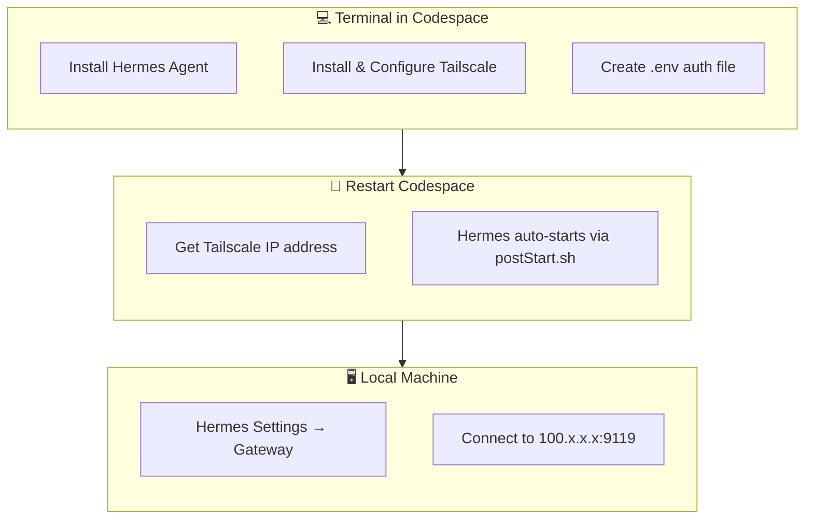
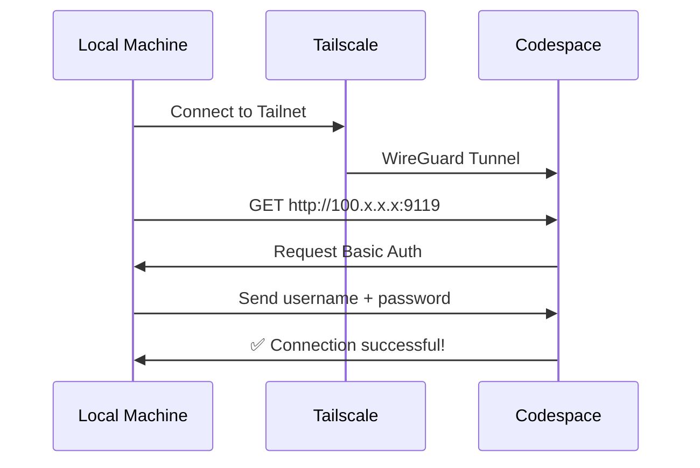

# Install Hermes Agent & Connect Remotely

> **Goal:** Install Hermes Agent in Codespace, set up Tailscale VPN, create Dashboard authentication, and connect from your local machine.
>
> ⏱️ **Time:** 15 minutes

---

## 🗺️ Overview

This is the final and most important step — turning your Codespace into a personal Hermes server accessible from anywhere.

**Workflow:**



---

## 📋 Prerequisites

- ✅ A running Codespace (see [Step 5: Create a Codespace](05-create-codespace.md))
- ✅ Terminal window open in your Codespace
- ✅ A free [Tailscale](https://tailscale.com) account

---

## Step 1: Open the Terminal in Your Codespace

After the Codespace starts, you'll see the VS Code interface in your browser. Open a terminal:

- **Method 1:** Press `` Ctrl+` `` (backtick)
- **Method 2:** Menu → Terminal → New Terminal
- **Method 3:** Click the "Terminal" tab in the bottom panel

Make sure you're in Bash (default) and your working directory is `/workspaces/<your-repo-name>`.

```bash
pwd
# Result: /workspaces/<your-repo-name>
```

---

## Step 2: Install Hermes Agent

> **Note:** If you're using `.devcontainer/postCreate.sh` from [Step 3](03-setup-devcontainer.md), Hermes **is already installed** — you can skip this step.

If you need to install manually (postCreate.sh hasn't run or you need to reinstall), run:

```bash
curl -fsSL https://hermes-agent.nousresearch.com/install.sh | bash
```

**Expected result:**

```
✓ Hermes Agent installed successfully
  Installation path: /home/codespace/.local/bin/hermes
  Version: x.y.z
```

Verify Hermes is installed:

```bash
hermes --version
```

> ⚠️ If you get `command not found`, add the path to your PATH:
> ```bash
> export PATH="$PATH:/home/codespace/.local/bin"
> echo 'export PATH="$PATH:/home/codespace/.local/bin"' >> ~/.bashrc
> ```

---

## Step 3: (Optional) Import Backup from Local Machine

If you've used Hermes on your local machine and want to bring all your data (skills, plugins, memories, config), follow these steps:

### 3.1. On Local Machine — Export Backup

```bash
hermes backup
```

This creates a `hermes-backup-<date>.zip` file in the current directory.

### 3.2. Upload to Codespace

Drag the `.zip` file from your local machine into the **Explorer panel** in VS Code (in the browser). The file will appear in your working directory (`/workspaces/<your-repo-name>/`).

> 💡 **Fast disk tip:** Use `/tmp` for uploads (fast SSD, ~44 GB). Press `Ctrl+Shift+P`, choose **Open Folder**, type `/tmp`, then drag your backup file into the Explorer. Import immediately after uploading — `/tmp` is wiped when the Codespace stops.

### 3.3. Import into Codespace

In the Codespace terminal:

```bash
hermes import hermes-backup-<date>.zip
```

> 💡 **Benefit:** Importing a backup gives you all your skills, plugins, and configuration right away — no need to set everything up from scratch.

---

## Step 4: Run the Setup Wizard (First Time)

When you run Hermes for the first time in Codespace, a setup wizard will appear. You can launch it now:

```bash
hermes
```

The wizard will ask a few basic questions:

| Question | Suggested Response |
|----------|-------------------|
| **Provider** | Choose `openai` or your preferred provider |
| **API Key** | Enter your API key (or leave blank if you don't have one yet) |
| **Model** | Enter model name (e.g., `gpt-4o`) |
| **Profile name** | Set a profile name, e.g., `codespace` |

You can **skip the wizard** with `Ctrl+C` and configure later — since we're using Hermes in server mode, not local CLI.

> 💡 **Tip:** Detailed configuration can be edited later via `~/.hermes/profiles/default/config.yaml`.

---

## Step 5: Set Up Tailscale

### 5.1. What Is Tailscale and Why Do We Need It?

GitHub Codespaces is a temporary environment — no fixed public IP and no way to expose ports to the public internet. Here's why that matters:

| Problem | Solution |
|---------|----------|
| ❌ Codespace has no fixed public IP | ✅ Tailscale assigns a **stable** virtual IP (100.x.x.x) |
| ❌ Port 9119 can't be accessed from outside | ✅ Tailscale creates a secure VPN tunnel |
| ❌ No custom domain (Nous sub) | ✅ Tailscale mesh network works like a private LAN |

**Tailscale** creates a private virtual mesh network (VPN) based on **WireGuard**, connecting your Codespace and local machine into a single LAN — secure, encrypted, and free for personal use.

### 5.2. Install Tailscale in Codespace

> ✅ **Already installed?** If you used `.devcontainer/postCreate.sh` from Step 3, Tailscale is already installed — skip to [5.3](#53-the-problem-codespace-is-a-docker-container-no-systemd).

```bash
curl -fsSL https://tailscale.com/install.sh | sh
```

Expected result — Tailscale is installed to `/usr/bin/tailscale` and `/usr/sbin/tailscaled`.

### 5.3. The Problem: Codespace Is a Docker Container (No systemd)

Codespaces run inside Docker containers, and containers **don't have systemd** — the traditional background service manager. This means you can't use `systemctl start tailscaled`.

The fix is to **start tailscaled manually** using two terminals:

**Terminal 1 — Start the daemon:**

```bash
sudo tailscaled --tun=userspace-networking --socks5-server=localhost:1055 --outbound-http-proxy-listen=localhost:1055 &
```

> **Explanation:**
> - `--tun=userspace-networking`: Userspace mode (no kernel TUN/TAP required — works in containers)
> - `--socks5-server=...`: SOCKS5 proxy for outbound connections
> - `--outbound-http-proxy-listen=...`: HTTP proxy for outbound traffic
> - `&`: Run in the background

**Terminal 2 — Authenticate with Tailscale:**

After the daemon is running, open a second terminal (or use the same one if you added `&`) and run:

```bash
sudo tailscale up
```

This will display a URL. **Click the URL** (or copy-paste it into your browser), log in with your Tailscale account, and confirm.

```
To authenticate, visit:
    https://login.tailscale.com/a/abc123
```

> 💡 **Important note:** If you've configured `.devcontainer/postStart.sh` as instructed, tailscaled **will start automatically** every time the Codespace boots — you don't need to run the two commands above again. The first time, you'll still need to run `sudo tailscale up` to authenticate.

### 5.4. Verify Tailscale Is Working

```bash
# Check status (connected machines)
tailscale status

# Result:
# 100.x.x.x    codespace-xxx    username@     linux   -
# 100.y.y.y    your-laptop      username@     windows -

# Get Codespace IP address
tailscale ip
# Result: 100.x.x.x (save this IP — you'll need it!)
```

### 5.5. Install Tailscale on Your Local Machine

To connect to the Codespace, your local machine also needs Tailscale.

| OS | How to Install |
|----|----------------|
| **Windows** | Download from [tailscale.com/download/windows](https://tailscale.com/download/windows) → run installer → log in |
| **macOS** | `brew install --cask tailscale` or download from [tailscale.com/download/mac](https://tailscale.com/download/mac) |
| **Linux** | `curl -fsSL https://tailscale.com/install.sh | sh` + `sudo tailscale up` |

After installing, log in with the **same Tailscale account** on your local machine. When both machines are in the same tailnet, you can test with ping:

```bash
# On local machine (ping the Codespace)
ping 100.x.x.x
# If you get replies → connection successful!
```

---

## Step 6: Create Dashboard Authentication

The Hermes server needs authentication to protect the Dashboard from unauthorized access. Create a `.env` file in `~/.hermes/`:

```bash
# Create directory if it doesn't exist
mkdir -p ~/.hermes

# Create .env file with authentication info
cat > ~/.hermes/.env << 'EOF'
HERMES_DASHBOARD_BASIC_AUTH_USERNAME=admin
HERMES_DASHBOARD_BASIC_AUTH_PASSWORD=<replace-with-strong-password>
HERMES_DASHBOARD_BASIC_AUTH_SECRET=<replace-with-secret-string>
EOF

# Protect the file — only owner can read
chmod 600 ~/.hermes/.env
```

### Field Explanation:

| Variable | Description | Suggestion |
|----------|-------------|------------|
| `HERMES_DASHBOARD_BASIC_AUTH_USERNAME` | Dashboard login username | `admin` or your preferred name |
| `HERMES_DASHBOARD_BASIC_AUTH_PASSWORD` | Login password | Use a strong password, at least 12 characters |
| `HERMES_DASHBOARD_BASIC_AUTH_SECRET` | Secret string for JWT/session | Generate using the command below |

Generate a random secret:

```bash
# Method 1: Using openssl (recommended)
openssl rand -base64 32

# Method 2: Using Python (if openssl isn't available)
python3 -c "import secrets; print(secrets.token_urlsafe(32))"
```

Copy the output and paste it into the `HERMES_DASHBOARD_BASIC_AUTH_SECRET` field in the `.env` file.

> ⚠️ **Security warnings:**
> - NEVER commit `.env` files to Git
> - NEVER use weak passwords like `123456` or `admin`
> - Always set `chmod 600` so no one else can read it
> - `.env` is already added to `.gitignore` in the template project

---

## Step 7: Restart Codespace

### 7.1. Save Your Tailscale IP

```bash
tailscale ip
# Example: 100.87.123.45
```

**Save this address** — you'll need it to connect from your local machine.

### 7.2. Stop the Codespace

There are two ways to stop a Codespace:

**Method 1 — Via browser:**
1. Go to [github.com/codespaces](https://github.com/codespaces)
2. Find your Codespace
3. Click the `...` (More actions) → **Stop codespace**

**Method 2 — Via terminal (inside Codespace):**
```bash
# This command will stop the Codespace (you'll be disconnected)
gh codespace stop
```

### 7.3. Restart the Codespace

1. Go to [github.com/codespaces](https://github.com/codespaces)
2. Click on your Codespace name to restart it
3. Wait 20-30 seconds for the Codespace to boot and run `postStart.sh`

### 7.4. Check startup.log

Once the Codespace is running again, open a terminal and check the log:

```bash
cat /workspaces/<your-repo-name>/startup.log
```

**Expected result:**

```
=== postStart.sh started at Sat Jul  9 10:00:00 UTC 2026 ===
[INFO] Waiting for Codespace to stabilize...
[INFO] Starting tailscaled...
[INFO] Waiting for Docker...
[INFO] Docker is ready.
[INFO] Waiting for tailscaled process...
[INFO] tailscaled is running.
[INFO] Starting Hermes server...
[SUCCESS] Hermes server started successfully.
```

> ❗ **If you see `[ERROR] Hermes server failed to start`:**
> 1. Check detailed logs: `cat /workspaces/<your-repo-name>/hermes.log`
> 2. Check if Hermes is installed: `which hermes`
> 3. Try starting manually: `hermes serve --host 0.0.0.0 --port 9119 &`

Verify Hermes is running:

```bash
# Check process
ps aux | grep hermes

# Check port 9119
ss -tlnp | grep 9119
```

---

## Step 8: Connect from Your Local Machine

### 8.1. Open Hermes Desktop on Your Local Machine

Make sure your local machine has [Hermes Agent](https://hermes-agent.nousresearch.com/docs) installed and Tailscale is running (see Step 5.5).

### 8.2. Configure Remote Gateway

1. Open **Hermes Settings** (or `hermes config`)
2. Go to **Gateway**
3. Enter the address: `http://100.x.x.x:9119` (replace `100.x.x.x` with the IP you saved)
4. Click **Authenticate**



### 8.3. Authenticate

When prompted, enter:
- **Username:** The value of `HERMES_DASHBOARD_BASIC_AUTH_USERNAME`
- **Password:** The value of `HERMES_DASHBOARD_BASIC_AUTH_PASSWORD`

### 8.4. Save and Connect

1. Click **Save and Reconnect**
2. Wait a few seconds — Hermes Desktop will switch to **Connected** status
3. Check the status bar: you'll see a green connection icon (🟢)

**Verify the connection:**

```bash
# On local machine, check Hermes can call the remote API
hermes status
# Result: Connected to remote Hermes at http://100.x.x.x:9119
```

---

## Step 9: Manage Core-Hours

GitHub Free gives you **120 core-hours/month**. Every time your Codespace runs, you consume core-hours based on the number of cores and uptime.

### 9.1. Core-Hours Table

| Codespace Type | Cores | RAM | Burn Rate | 120h Lasts |
|----------------|-------|-----|-----------|------------|
| **2-core** 💡 | 2 vCPU | 8 GB | 2 core-hours/hour | ~60 hours/month |
| **4-core** | 4 vCPU | 8 GB | 4 core-hours/hour | ~30 hours/month |

### 9.2. Recommendations

- ✅ **2-core** is sufficient for most personal Hermes server needs
- ✅ **4-core** if you run heavy workloads, but remember it burns core-hours twice as fast

### 9.3. Choosing Machine Type When Creating a Codespace

1. When creating a Codespace, click **Configure**
2. In the **Machine type** dropdown, choose:
   - `2-core` → for most users
   - `4-core` → if you need more performance
3. Confirm Codespace creation

> 💡 **Tip:** You can change the machine type even while the Codespace is running: Settings → Codespaces → Change machine type.

---

## Step 10: Tips & Billing Information

### 10.1. Optimization Tips

| Tip | Detail |
|-----|--------|
| 🛑 **Always Stop when not in use** | A running Codespace still burns core-hours. Always stop when not using it. |
| 🔄 **Use Idle Timeout** | Configured in [Step 4](04-configure-idle-timeout.md) — Codespace auto-stops after 240 minutes of inactivity. |
| ⚡ **Use /tmp for scratch files** | `/tmp` has **44 GB of super-fast SSD** — double the main disk! Use it for downloads, extraction, and compiling large files. Remember to copy results back to your working directory before shutdown (because /tmp is wiped on restart). |
| 📊 **Monitor usage** | [github.com/settings/codespaces](https://github.com/settings/codespaces) → Usage |
| 🧹 **Delete old Codespaces** | Old Codespaces still show in the list. Delete unused ones to avoid confusion. |
| 💾 **Backup regularly** | `hermes backup` to export data periodically — in case the Codespace gets deleted. |
| 🚀 **Use postCreate.sh** | This script installs Hermes automatically — saves time every time you create a new Codespace. |

### 10.2. Billing Information

| Scenario | Cost |
|----------|------|
| 2-core Codespace, running 30h/month | **Free** (within 120 core-hours Free) |
| 4-core Codespace, running 30h/month | **Free** (uses 120/120 core-hours) |
| 8-core Codespace, running 30h/month | **~$18 extra** (over quota) |
| GitHub Pro ($4/month) | Increases quota to 180 core-hours/month |

> 💡 **Conclusion:** For personal use running Hermes a few hours a day, a **GitHub Free + 2-core Codespace** is completely free and sufficient.

---

## 🧪 Troubleshooting

### Issue 1: Can't Connect from Local Machine

```
Connection refused or timeout
```

**Check:**
1. Is Tailscale running on both Codespace and local machine?
2. Can you ping the Codespace? → `ping 100.x.x.x`
3. Is Hermes server running? → `ps aux | grep hermes` (inside Codespace)
4. Is firewall blocking port 9119?

### Issue 2: Authentication Error

```
401 Unauthorized
```

**Check:**
1. Does `.env` file exist? → `ls -la ~/.hermes/.env`
2. Are file permissions correct? → `stat ~/.hermes/.env` (should be `-rw-------`)
3. Is the file syntax correct? No stray quotes or extra spaces?

### Issue 3: Tailscale Won't Connect

```
No internet connection or tailscaled not running
```

**Check:**
1. Is tailscaled running? → `ps aux | grep tailscaled`
2. Are you logged in? → `tailscale status`
3. Try running again: `sudo tailscale up`

---

## ✅ Conclusion

After this step, you've completed the entire setup process!

| Task | Status |
|------|--------|
| 🔧 Codespace running 24/7 | ✅ |
| 🚀 Hermes Agent installed | ✅ |
| 🔒 Tailscale VPN connected | ✅ |
| 🔑 Dashboard Auth configured | ✅ |
| 🖥️ Remote connection from local machine | ✅ |

Your Hermes Desktop on your local machine is now controlling a Hermes Agent running remotely on Codespace — completely free, secure, and always ready.

---

---

<!-- Navigation -->
<p align="center">
  <a href="05-create-codespace.md">← Step 5: Create a Codespace</a>
  &nbsp;&nbsp;|&nbsp;&nbsp;
  <a href="07-codespace-cli-management.md">Step 7: CLI Management →</a>
</p>

<p align="center">
  <strong>Part 6 / 7</strong>
</p>

---

> **Have questions?** Open a [GitHub Issue](https://github.com/skappafrost/codespaces-hermes-server/issues) or email **[skappafrost@gmail.com](mailto:skappafrost@gmail.com)**.
