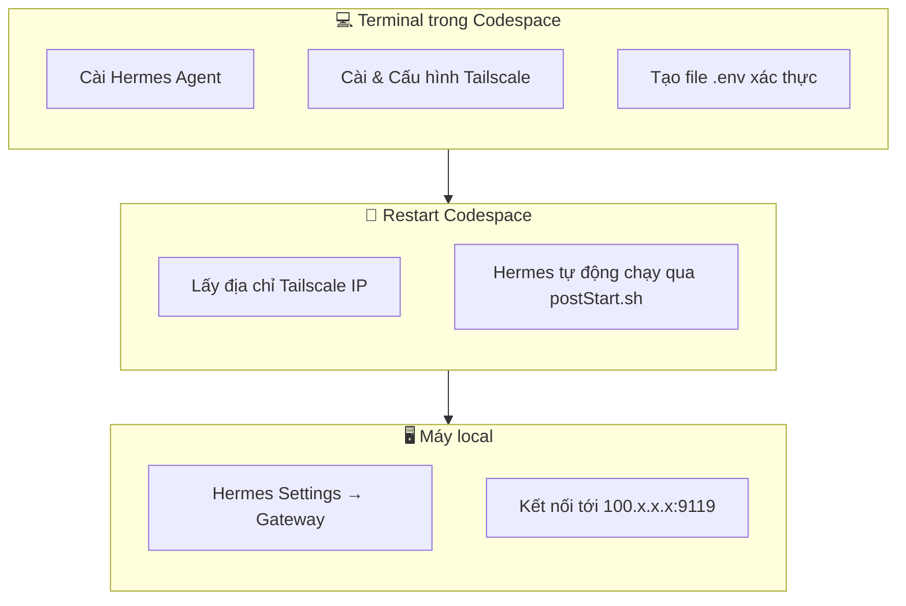
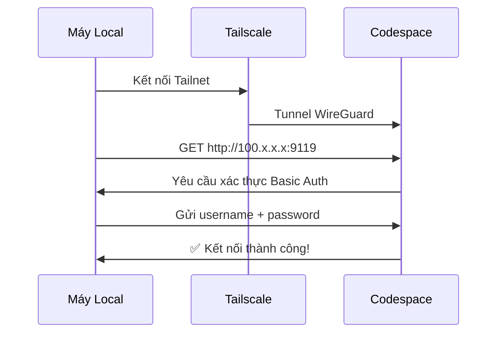

# Cài đặt Hermes Agent & Kết nối Remote

> **Mục tiêu:** Cài Hermes Agent trong Codespace, thiết lập Tailscale VPN, tạo xác thực Dashboard, và kết nối từ máy local.
>
> ⏱️ **Thời gian:** 15 phút

---

## 🗺️ Tổng quan

Đây là bước cuối cùng và quan trọng nhất — biến Codespace của bạn thành một Hermes server cá nhân có thể truy cập từ mọi nơi.

**Luồng công việc:**



---

## 📋 Điều kiện trước

- ✅ Codespace đã được tạo thành công (xem [Bài 5: Tạo Codespace](05-create-codespace.md))
- ✅ Cửa sổ terminal trong Codespace đang mở
- ✅ Tài khoản [Tailscale](https://tailscale.com) miễn phí đã được tạo

---

## Bước 1: Mở Terminal trong Codespace

Sau khi Codespace khởi động, bạn sẽ thấy giao diện VS Code trong trình duyệt. Mở terminal bằng cách:

- **Cách 1:** Nhấn `Ctrl + `` ` (backtick)
- **Cách 2:** Menu → Terminal → New Terminal
- **Cách 3:** Click vào tab "Terminal" ở panel dưới

Đảm bảo terminal đang ở Bash (mặc định) và thư mục làm việc là `/workspaces/<tên-repo-của-bạn>`.

```bash
pwd
# Kết quả: /workspaces/<tên-repo-của-bạn>
```

---

## Bước 2: Cài đặt Hermes Agent

> **Lưu ý:** Nếu bạn đang dùng `.devcontainer/postCreate.sh` như hướng dẫn ở [Bài 3](03-setup-devcontainer.md), Hermes **đã được cài sẵn** và bạn có thể bỏ qua bước này.

Nếu cần cài thủ công (khi postCreate.sh chưa chạy hoặc cần cài lại), chạy lệnh sau trong terminal:

```bash
curl -fsSL https://hermes-agent.nousresearch.com/install.sh | bash
```

**Kết quả mong đợi:**

```
✓ Hermes Agent installed successfully
  Installation path: /home/codespace/.local/bin/hermes
  Version: x.y.z
```

Xác nhận Hermes đã được cài:

```bash
hermes --version
```

> ⚠️ Nếu gặp lỗi `command not found`, hãy thêm đường dẫn vào PATH:
> ```bash
> export PATH="$PATH:/home/codespace/.local/bin"
> echo 'export PATH="$PATH:/home/codespace/.local/bin"' >> ~/.bashrc
> ```

---

## Bước 3: (Tùy chọn) Import Backup từ máy local

Nếu bạn đã sử dụng Hermes trên máy local và muốn mang theo toàn bộ dữ liệu (skills, plugins, memories, config), hãy làm như sau:

### 3.1. Trên máy local — Export backup

```bash
hermes backup
```

Lệnh này sẽ tạo file `hermes-backup-<ngày>.zip` trong thư mục hiện tại.

### 3.2. Upload lên Codespace

Kéo file `.zip` từ máy local thả vào **Explorer panel** trong VS Code (trên trình duyệt) để upload lên Codespace. File sẽ xuất hiện trong thư mục làm việc của bạn (`/workspaces/<tên-repo-của-bạn>/`).

> 💡 **Mẹo ổ cứng nhanh:** Dùng `/tmp` để upload (SSD siêu nhanh, ~44 GB). Nhấn `Ctrl+Shift+P`, chọn **Open Folder**, gõ `/tmp`, kéo file backup vào Explorer. Import ngay sau khi upload — `/tmp` bị xoá khi Codespace tắt.

### 3.3. Import vào Codespace

Trong terminal Codespace:

```bash
hermes import hermes-backup-<ngày>.zip
```

> 💡 **Lợi ích:** Import backup giúp bạn có ngay toàn bộ skills, plugins, và cấu hình đã thiết lập sẵn, không phải config lại từ đầu.

---

## Bước 4: Chạy Setup Wizard (Lần đầu)

Khi chạy Hermes lần đầu trong Codespace, bạn sẽ thấy một trình hướng dẫn thiết lập (setup wizard). Bạn có thể chạy nó ngay:

```bash
hermes
```

Wizard sẽ hỏi một số câu hỏi cơ bản:

| Câu hỏi | Gợi ý trả lời |
|---------|---------------|
| **Provider** | Chọn `openai` hoặc provider bạn muốn dùng |
| **API Key** | Nhập API key tương ứng (hoặc để trống nếu chưa có) |
| **Model** | Nhập tên model (vd: `gpt-4o`) |
| **Profile name** | Đặt tên profile, vd: `codespace` |

Bạn có thể **bỏ qua wizard** bằng `Ctrl+C` và cấu hình sau — vì chúng ta sẽ dùng Hermes ở chế độ server, không phải CLI local.

> 💡 **Mẹo:** Cấu hình chi tiết có thể được chỉnh sửa sau qua file `~/.hermes/profiles/default/config.yaml`.

---

## Bước 5: Thiết lập Tailscale

### 5.1. Tailscale là gì? Tại sao cần nó?

GitHub Codespaces là môi trường tạm thời, không có địa chỉ IP cố định và không cho phép mở port ra internet công cộng. Điều này có nghĩa là:

| Vấn đề | Giải pháp |
|--------|-----------|
| ❌ Codespace không có IP công cộng cố định | ✅ Tailscale gán IP ảo **cố định** (100.x.x.x) |
| ❌ Port 9119 không thể truy cập từ bên ngoài | ✅ Tailscale tạo tunnel an toàn qua VPN |
| ❌ Không có tên miền riêng (Nous sub) | ✅ Tailscale mesh network hoạt động như mạng LAN riêng |

**Tailscale** tạo một mạng riêng ảo (mesh VPN) dựa trên **WireGuard**, kết nối Codespace và máy local của bạn thành một mạng LAN duy nhất — an toàn, mã hóa, và miễn phí cho cá nhân sử dụng.

### 5.2. Cài đặt Tailscale trong Codespace

> ✅ **Đã cài rồi?** Nếu bạn dùng `.devcontainer/postCreate.sh` từ Bài 3, Tailscale đã được cài sẵn — bỏ qua bước này, xuống [5.3](#53-vấn-đề-với-docker-container-không-có-systemd).

```bash
curl -fsSL https://tailscale.com/install.sh | sh
```

Kết quả mong đợi — Tailscale được cài vào `/usr/bin/tailscale` và `/usr/sbin/tailscaled`.

### 5.3. Vấn đề với Docker Container (Không có systemd)

Codespace chạy trong Docker container, và container **không có systemd** — dịch vụ nền truyền thống. Điều này có nghĩa là bạn không thể dùng `systemctl start tailscaled`.

Giải pháp là **khởi động tailscaled thủ công** bằng hai terminal:

**Terminal 1 — Chạy daemon tailscaled:**

```bash
sudo tailscaled --tun=userspace-networking --socks5-server=localhost:1055 --outbound-http-proxy-listen=localhost:1055 &
```

> **Giải thích:**
> - `--tun=userspace-networking`: Chế độ userspace (không cần kernel TUN/TAP — hoạt động trong container)
> - `--socks5-server=...`: Proxy SOCKS5 cho các kết nối ra ngoài
> - `--outbound-http-proxy-listen=...`: Proxy HTTP cho outbound traffic
> - `&`: Chạy ngầm trong background

**Terminal 2 — Đăng nhập Tailscale:**

Sau khi daemon đã chạy, mở terminal thứ hai (hoặc dùng cùng terminal nếu bạn thêm `&`) và chạy:

```bash
sudo tailscale up
```

Lệnh này sẽ hiện ra một URL. **Click vào URL đó** (hoặc copy-paste vào trình duyệt), đăng nhập tài khoản Tailscale của bạn, và xác nhận.

```
To authenticate, visit:
    https://login.tailscale.com/a/abc123
```

> 💡 **Lưu ý quan trọng:** Nếu bạn đã cấu hình `.devcontainer/postStart.sh` như hướng dẫn, tailscaled **sẽ tự động chạy** mỗi khi Codespace khởi động — bạn không cần chạy lại hai lệnh trên. Lần đầu tiên bạn vẫn cần chạy `sudo tailscale up` để xác thực.

### 5.4. Xác minh Tailscale hoạt động

```bash
# Kiểm tra trạng thái (các máy đang kết nối)
tailscale status

# Kết quả:
# 100.x.x.x    codespace-xxx    username@     linux   -
# 100.y.y.y    your-laptop      username@     windows -

# Lấy địa chỉ IP của Codespace
tailscale ip
# Kết quả: 100.x.x.x (ghi lại IP này — bạn sẽ cần nó!)
```

### 5.5. Cài đặt Tailscale trên máy local

Để kết nối được với Codespace, máy local của bạn cũng cần chạy Tailscale.

| Hệ điều hành | Cách cài đặt |
|-------------|-------------|
| **Windows** | Tải từ [tailscale.com/download/windows](https://tailscale.com/download/windows) → chạy installer → đăng nhập |
| **macOS** | `brew install --cask tailscale` hoặc tải từ [tailscale.com/download/mac](https://tailscale.com/download/mac) |
| **Linux** | `curl -fsSL https://tailscale.com/install.sh | sh` + `sudo tailscale up` |

Sau khi cài, đăng nhập cùng tài khoản Tailscale trên máy local. Khi cả hai máy cùng trong tailnet, bạn có thể ping thử:

```bash
# Trên máy local (ping đến Codespace)
ping 100.x.x.x
# Nếu có reply → kết nối thành công!
```

---

## Bước 6: Tạo Dashboard Authentication

Hermes server cần xác thực để bảo vệ Dashboard khỏi truy cập trái phép. Bạn cần tạo file `.env` trong thư mục `~/.hermes/`.

```bash
# Tạo thư mục nếu chưa có
mkdir -p ~/.hermes

# Tạo file .env với thông tin xác thực
cat > ~/.hermes/.env << 'EOF'
HERMES_DASHBOARD_BASIC_AUTH_USERNAME=admin
HERMES_DASHBOARD_BASIC_AUTH_PASSWORD=<thay-bang-mat-khau-manh>
HERMES_DASHBOARD_BASIC_AUTH_SECRET=<thay-bang-chuoi-bi-mat>
EOF

# Bảo vệ file — chỉ chủ sở hữu mới đọc được
chmod 600 ~/.hermes/.env
```

### Giải thích các trường:

| Biến | Mô tả | Gợi ý |
|------|-------|-------|
| `HERMES_DASHBOARD_BASIC_AUTH_USERNAME` | Tên đăng nhập Dashboard | `admin` hoặc tên bạn muốn |
| `HERMES_DASHBOARD_BASIC_AUTH_PASSWORD` | Mật khẩu đăng nhập | Dùng mật khẩu mạnh, ít nhất 12 ký tự |
| `HERMES_DASHBOARD_BASIC_AUTH_SECRET` | Chuỗi bí mật cho JWT/session | Tạo bằng lệnh dưới đây |

Tạo chuỗi bí mật ngẫu nhiên:

```bash
# Cách 1: Dùng openssl (khuyên dùng)
openssl rand -base64 32

# Cách 2: Dùng Python (nếu openssl không có sẵn)
python3 -c "import secrets; print(secrets.token_urlsafe(32))"
```

Copy kết quả và dán vào trường `HERMES_DASHBOARD_BASIC_AUTH_SECRET` trong file `.env`.

> ⚠️ **Cảnh báo bảo mật:**
> - KHÔNG bao giờ commit file `.env` vào Git
> - KHÔNG dùng mật khẩu yếu như `123456`, `admin`
> - Luôn set `chmod 600` để người khác không đọc được
> - `.env` đã được thêm vào `.gitignore` của dự án mẫu

---

## Bước 7: Restart Codespace

### 7.1. Ghi lại địa chỉ Tailscale IP

```bash
tailscale ip
# Ví dụ: 100.87.123.45
```

**Ghi lại địa chỉ này** — bạn sẽ cần nó để kết nối từ máy local.

### 7.2. Dừng Codespace

Có hai cách để dừng Codespace:

**Cách 1 — Qua trình duyệt:**
1. Vào [github.com/codespaces](https://github.com/codespaces)
2. Tìm Codespace của bạn
3. Click vào dấu `...` (More actions) → **Stop codespace**

**Cách 2 — Qua terminal (trong Codespace):**
```bash
# Lệnh này sẽ dừng Codespace (bạn sẽ bị ngắt kết nối)
gh codespace stop
```

### 7.3. Khởi động lại Codespace

1. Vào [github.com/codespaces](https://github.com/codespaces)
2. Click vào tên Codespace để khởi động lại
3. Đợi 20-30 giây cho Codespace khởi động và chạy `postStart.sh`

### 7.4. Kiểm tra startup.log

Khi Codespace đã chạy trở lại, mở terminal và kiểm tra log:

```bash
cat /workspaces/<tên-repo-của-bạn>/startup.log
```

**Kết quả mong đợi:**

```
=== postStart.sh started at Sat Jul  9 10:00:00 UTC 2026 ===
[INFO] Waiting for Codespace to stabilize...
[INFO] Starting tailscaled...
[INFO] Waiting for Docker...
[INFO] Docker is ready.
[INFO] Waiting for tailscaled process...
[INFO] tailscaled is running.
[INFO] Starting Hermes server...
[SUCCESS] Hermes server started successfully.
```

> ❗ **Nếu thấy `[ERROR] Hermes server failed to start`:**
> 1. Kiểm tra log chi tiết: `cat /workspaces/<tên-repo-của-bạn>/hermes.log`
> 2. Kiểm tra Hermes đã được cài chưa: `which hermes`
> 3. Thử khởi động thủ công: `hermes serve --host 0.0.0.0 --port 9119 &`

Kiểm tra Hermes đang chạy:

```bash
# Kiểm tra tiến trình
ps aux | grep hermes

# Kiểm tra port 9119
ss -tlnp | grep 9119
```

---

## Bước 8: Kết nối từ máy local

### 8.1. Mở Hermes Desktop trên máy local

Đảm bảo máy local của bạn đã cài [Hermes Agent](https://hermes-agent.nousresearch.com/docs) và Tailscale đang chạy (xem Bước 5.5).

### 8.2. Cấu hình Remote Gateway

1. Mở **Hermes Settings** (hoặc `hermes config`)
2. Vào mục **Gateway** (Cổng kết nối)
3. Nhập địa chỉ: `http://100.x.x.x:9119` (thay `100.x.x.x` bằng IP bạn đã ghi lại)
4. Nhấn **Authenticate** (Xác thực)



### 8.3. Xác thực

Khi được yêu cầu, nhập:
- **Username:** Giá trị của `HERMES_DASHBOARD_BASIC_AUTH_USERNAME`
- **Password:** Giá trị của `HERMES_DASHBOARD_BASIC_AUTH_PASSWORD`

### 8.4. Lưu và Kết nối

1. Click **Save and Reconnect**
2. Đợi vài giây — Hermes Desktop sẽ chuyển sang trạng thái **Connected**
3. Kiểm tra thanh trạng thái: bạn sẽ thấy biểu tượng kết nối xanh (🟢)

**Xác minh kết nối thành công:**

```bash
# Trên máy local, kiểm tra Hermes có thể gọi API từ xa
hermes status
# Kết quả: Connected to remote Hermes at http://100.x.x.x:9119
```

---

## Bước 9: Quản lý Core-Hours

GitHub Free cho **120 core-hours/tháng**. Mỗi lần Codespace chạy, bạn tiêu thụ core-hours dựa trên số core và thời gian.

### 9.1. Bảng core-hours

| Loại Codespace | Số core | RAM | Tiêu thụ mỗi giờ | 120h dùng được |
|---------------|---------|-----|------------------|----------------|
| **2-core** 💡 | 2 vCPU | 8 GB | 2 core-hours/giờ | ~60 giờ/tháng |
| **4-core** | 4 vCPU | 8 GB | 4 core-hours/giờ | ~30 giờ/tháng |

### 9.2. Khuyến nghị

- ✅ **2-core** là đủ cho hầu hết nhu cầu chạy Hermes server cá nhân
- ✅ **4-core** nếu bạn chạy nhiều tác vụ nặng, nhưng nhớ là core-hours tiêu gấp đôi

### 9.3. Chọn machine type khi tạo Codespace

1. Khi tạo Codespace, click vào **Configure**
2. Trong dropdown **Machine type**, chọn:
   - `2-core` → cho hầu hết người dùng
   - `4-core` → nếu cần hiệu năng cao hơn
3. Xác nhận tạo Codespace

> 💡 **Mẹo:** Bạn có thể đổi machine type ngay cả khi Codespace đang chạy: Settings → Codespaces → Change machine type.

---

## Bước 10: Tips & Thông tin thanh toán

### 10.1. Tips tối ưu

| Mẹo | Chi tiết |
|-----|----------|
| 🛑 **Luôn Stop khi không dùng** | Codespace chạy ngầm vẫn tiêu tốn core-hours. Luôn stop khi không sử dụng. |
| 🔄 **Dùng Idle Timeout** | Đã cấu hình ở [Bài 4](04-configure-idle-timeout.md) — Codespace tự động stop sau 240 phút không hoạt động. |
| ⚡ **Dùng /tmp cho file tạm** | Thư mục `/tmp` có **44 GB SSD siêu nhanh** — gấp đôi ổ chính. Dùng để download, extract, compile file lớn. Nhớ copy kết quả về thư mục làm việc trước khi tắt Codespace (vì /tmp bị xoá khi shutdown). |
| 📊 **Theo dõi usage** | [github.com/settings/codespaces](https://github.com/settings/codespaces) → Usage |
| 🧹 **Xóa Codespace cũ** | Codespace cũ vẫn hiện trong danh sách. Xóa nếu không dùng nữa để tránh nhầm lẫn. |
| 💾 **Backup thường xuyên** | `hermes backup` để export dữ liệu định kỳ — phòng khi Codespace bị xóa. |
| 🚀 **Dùng postCreate.sh** | Script này cài Hermes tự động — tiết kiệm thời gian mỗi lần tạo Codespace mới. |

### 10.2. Thông tin thanh toán

| Kịch bản | Chi phí |
|----------|---------|
| Codespace 2-core, chạy 30h/tháng | **Miễn phí** (trong 120 core-hours Free) |
| Codespace 4-core, chạy 30h/tháng | **Miễn phí** (dùng 120/120 core-hours) |
| Codespace 8-core, chạy 30h/tháng | **Trả thêm ~$18** (vượt quota 120 core-hours) |
| GitHub Pro ($4/tháng) | Nâng quota lên 180 core-hours/tháng |

> 💡 **Kết luận:** Với nhu cầu cá nhân chạy Hermes vài giờ mỗi ngày, tài khoản **GitHub Free + Codespace 2-core** là hoàn toàn miễn phí và đủ dùng.

---

## 🧪 Xử lý sự cố

### Vấn đề 1: Không kết nối được từ máy local

```
Connection refused hoặc timeout
```

**Kiểm tra:**
1. Tailscale đã chạy trên cả Codespace và máy local?
2. Có thể ping được Codespace không? → `ping 100.x.x.x`
3. Hermes server đang chạy? → `ps aux | grep hermes` (trong Codespace)
4. Firewall có chặn port 9119?

### Vấn đề 2: Lỗi xác thực

```
401 Unauthorized
```

**Kiểm tra:**
1. File `.env` tồn tại chưa? → `ls -la ~/.hermes/.env`
2. File có đúng quyền? → `stat ~/.hermes/.env` (phải là `-rw-------`)
3. Nội dung file có đúng cú pháp? Không có dấu nháy kép thừa?

### Vấn đề 3: Tailscale không kết nối

```
No internet connection or tailscaled not running
```

**Kiểm tra:**
1. tailscaled đã chạy? → `ps aux | grep tailscaled`
2. Đã login chưa? → `tailscale status`
3. Thử chạy lại: `sudo tailscale up`

---

## ✅ Kết luận

Sau bước này, bạn đã hoàn thành toàn bộ quy trình thiết lập!

| Công việc | Trạng thái |
|-----------|-----------|
| 🔧 Codespace hoạt động 24/7 | ✅ |
| 🚀 Hermes Agent đã cài đặt | ✅ |
| 🔒 Tailscale VPN đã kết nối | ✅ |
| 🔑 Dashboard Auth đã cấu hình | ✅ |
| 🖥️ Kết nối remote từ máy local | ✅ |

Giờ đây, Hermes Desktop trên máy local của bạn đang điều khiển Hermes Agent chạy trên Codespace từ xa — hoàn toàn miễn phí, an toàn, và luôn sẵn sàng.

---

---

<!-- Navigation -->
<p align="center">
  <a href="05-create-codespace.md">← Bài 5: Tạo Codespace</a>
  &nbsp;&nbsp;|&nbsp;&nbsp;
  <a href="07-codespace-cli-management.md">Bài 7: CLI Management →</a>
</p>

<p align="center">
  <strong>Phần 6 / 7</strong>
</p>

---

> **Có câu hỏi?** Hãy mở [GitHub Issue](https://github.com/skappafrost/codespaces-hermes-server/issues) hoặc gửi email tới **[skappafrost@gmail.com](mailto:skappafrost@gmail.com)**.
